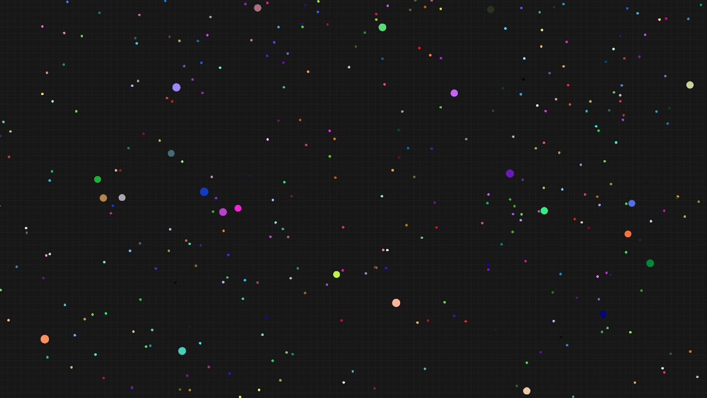

# BacterAI

An attempt at creating a simple life simulation in Godot using [NEAT for Godot](https://github.com/pastra98/NEAT_for_Godot) library. Mechanics are inspired by the game Agario where bigger cells eat smaller cells.



## Prerequisites
- [Godot 3](https://godotengine.org)

## Running
Import `project.godot` in the editor. After running the game for the first time, you will need to copy the `custom.cfg` config file to a folder called `param_configs` in your user directory. Here are the exact paths for each operating system:


GNU/Linux
```
~/.local/share/godot/app_userdata/BacterAI/param_configs
```

Windows
```
%APPDATA%\Godot\app_userdata\BacterAI\param_configs
```

MacOS
```
~/Library/Application Support/Godot/app_userdata/BacterAI/param_configs
```

Feel free to modify `custom.cfg` to adjust NEAT algorithm settings. Saved networks will be stored in `network_configs` directory.
